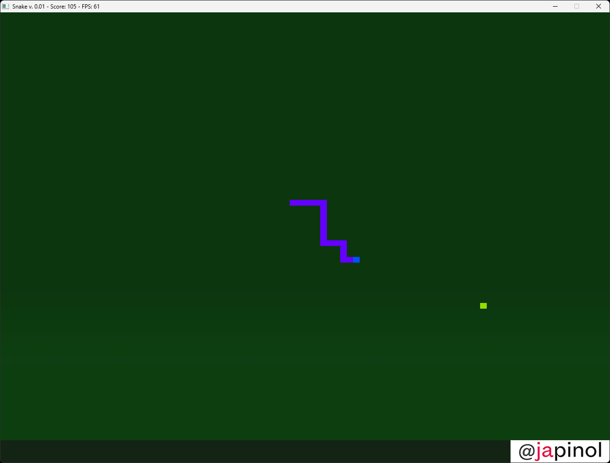

## Snake

	Snake basic game implemented in C++ using SDL2.

	version: 0.0.1
	author: Joan A. Pinol
	author_nickname: japinol
	author_gitHub: japinol7
	author_twitter: @japinol
	dependencies: SDL2, SDL2_image
	C++ requires: 20 or greater.

## Screenshots

  

## Rules and user guide

	> A snake can move to the following directions: left, right, up, down.
	> A snake has a head of one piece and starts with a body length of N pieces. 
	> Each time a snake eats an apple, its body grows by N pieces, normally by one.
	> If the head of a snake collides with its body, it dies.

## Keyboard keys
     F1:    show a help screen while playing the game
     ESC:   exit the game
     left,     a:    move snake to the left
     right,    d:    move snake to the right
     up,       w:    move snake up
     down,     s:    move snake down

## Usage

	snake usage: app [-h  --help] [-f  --fullscreen]
                     [-g  --cells-width-qty] QTY 
                     [-b  --body-pieces] QTY 
                     [-r  --body-size-to-increase] QTY 
                     [-s  --snake-speed] QTY
	
	optional arguments:
	  -h, --help    show this help message and exit
	  -f, 		--fullscreen
	                start the game in full screen mode.
	  -g QTY,	--cells-width-qty QTY
	                cells qty for the width of the screen.
	                Cells qty for the height of the screen is calculated automatically
	  -b QTY,	--body-pieces QTY
	                body pieces of the snake at the start of the game
	  -r QTY,	--body-size-to-increase QTY
	                when the snake grows, it will grow QTY pieces
	  -s QTY,	--snake-speed QTY
	                snake starting speed

**Default optional arguments**

	Argument                Default     Interval
	................        ......      .........
	fullscreen              false
	body-pieces             5           [0, 50]
	cells-width-qty         100         [30, 250]
	body-size-to-increase   1           [0, 5]
	snake-speed             0.6         [0.3, 0.95]

**Examples of usage**

	Run examples using bash on Linux:
     $ ./snake --body-pieces 5 --cells-width-qty 90
     $ ./snake --body-pieces 5 --cells-width-qty 90 --fullscreen
     $ ./snake --body-pieces 30 --cells-width-qty 200 --snake-speed 0.95 --fullscreen
     $ ./snake --body-pieces 5 --cells-width-qty 50 --snake-speed 0.4

	Run examples using bash on Windows:
     $ ./snake.exe --body-pieces 5 --cells-width-qty 90
     $ ./snake.exe --body-pieces 5 --cells-width-qty 90 --fullscreen
     $ ./snake.exe --body-pieces 30 --cells-width-qty 200 --snake-speed 0.95 --fullscreen
     $ ./snake.exe --body-pieces 5 --cells-width-qty 50 --snake-speed 0.4
